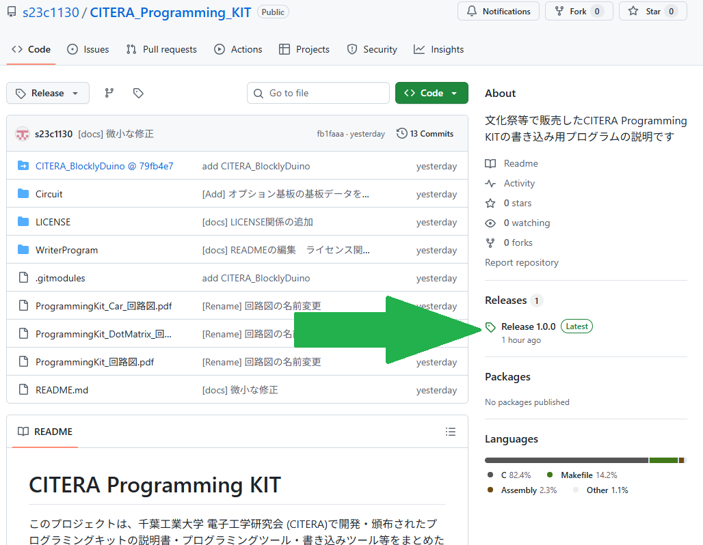

# CITERA Programming KIT
このプロジェクトは、千葉工業大学 電子工学研究会 (CITERA)で開発・頒布されたプログラミングキットの説明書・プログラミングツール・書き込みツール等をまとめたものです。

## プログラミング・書き込みツールの導入方法

あ

## プログラミングツールの説明
準備中...

## 書き込みツールの説明
準備中...

## ライセンス
各ツール・設計図のライセンスについては、各フォルダに含まれている`README.md`をご参照ください。

`ProgrammingKit_回路図.pdf` 
`ProgrammingKit_DotMatrix_回路図.pdf` 
`ProgrammingKit_Car_回路図.pdf` 
の著作権は CITERA また 23C1130 が保持しています。また、この回路図データは Creative Commons Attribution 4.0 International (CC BY 4.0) ライセンスの下で提供されています。
https://creativecommons.org/licenses/by/4.0/

## 外部ツールについて
### Zadig
このプロジェクトにはUSBドライバインストールツール Zadigを使用しています。 
またReleaseにバイナリファイル（実行ファイル）が同梱されています。 
- ライセンス:GPLv3
- ソースコード:https://github.com/pbatard/libwdi
- 公式HP:https://zadig.akeo.ie/

ZadigはGPLv3ライセンスの条件に基づいて再配布されています。 
詳しくは`LICENSE/GPL-3.0.txt`をご参照ください。
### wchisp
このプロジェクトにはWCH ISP Tool wchispを使用しています。 
またReleaseにバイナリファイル（実行ファイル）が同梱されています。 
- ライセンス:GPLv2
- ソースコード:https://github.com/ch32-rs/wchisp
- バイナリコード配布先:https://github.com/ch32-rs/wchisp/releases/

wchispはGPLv2ライセンスの条件に基づいて再配布されています。 
詳しくは`LICENSE/GPL-2.0.txt`をご参照ください。

### xPack RISC-V Embedded GCC
このプロジェクトにはxPack GNU RISC-V Embedded GCCを使用しています。 
またReleaseにバイナリファイル（実行ファイル）が同梱されています。 
- ライセンス:GPLv3 with Runtime Exception + MITライセンス
- ソースコード:https://github.com/openwch/risc-none-embed-gcc
- バイナリコード配布先:https://github.com/openwch/risc-none-embed-gcc/releases

xPack GNU RISC-V Embedded GCCはMITライセンスの条件に基づいて再配布されています。 
詳しくは`LICENSE/MIT.txt`をご参照ください。
また、GPLv3 with Runtime Exceptionの条件に基づいて再配布されています。 
詳しくは`LICENSE/gcc-exception-3.1.txt`をご参照ください。

### BusyBox-w32
このプロジェクトにはBusyBox-w32を使用しています。 
またReleaseにバイナリファイル（実行ファイル）が同梱されています。 
- ライセンス:GPLv2
- ソースコード:https://github.com/rmyorston/busybox-w32
- 公式HP:https://frippery.org/busybox/

BusyBox-w32はGPLv2ライセンスの条件に基づいて再配布されています。 
詳しくは`LICENSE/GPL-2.0.txt`をご参照ください。

### GNU Make
このプロジェクトにはGNU makeを使用しています。 
またReleaseにバイナリファイル（実行ファイル）が同梱されています。 
- ライセンス:GPLv3
- ソースコード入手先/公式HP:https://www.gnu.org/software/make/

GNU MakeはGPLv2ライセンスの条件に基づいて再配布されています。 
詳しくは`LICENSE/GPL-3.0.txt`をご参照ください。