# CITERA Programming KIT
このプロジェクトは、千葉工業大学 電子工学研究会 (CITERA)で開発・頒布されたプログラミングキットの説明書・プログラミングツール・書き込みツール等をまとめたものです。

質問などは下のGoogle Formをご利用ください 
https://forms.gle/aoQnFYQyJ1tKQqx78

バグの報告や機能の追加の希望等は上のGoogle Formをご利用いただくか、Issueを立ち上げてください。

**自己責任で導入を行ってください** 

## 使用できる環境・推奨環境
このプログラムは次の環境で動作確認されています。
- Windows 11 (24H2)

最低限必要な環境は以下の通りです。
- Windows 11

必須ソフトとして.NET Framework 4.8が必要です。（Windows 11には初期状態で含まれています。）
.NET Framework 4.8 が入っていない環境の場合、下のリンクから、ランタイムをダウンロード・インストールしてください。

https://dotnet.microsoft.com/ja-jp/download/dotnet-framework/net48

（Windows 7以降の環境であれば動作すると思われますが、OSサポート終了のため推奨しません）

## プログラミング・書き込みツールの導入方法
ダウンロードしてから展開するだけでプログラミング・書き込みできるようになるReleaseファイルを配布しています。

矢印の先にReleasesがあります。これをクリックします。

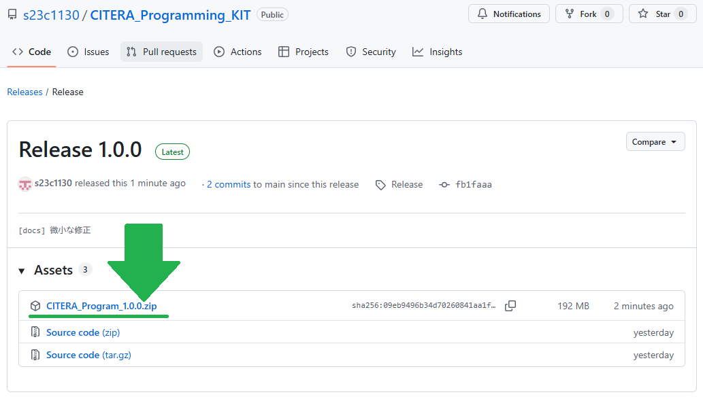
Assetsにある`CITERA_Program_X.X.X.zip`をクリックし、ダウンロードします。

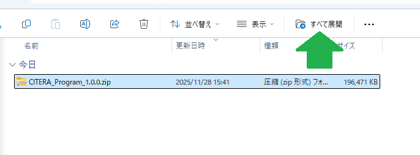
エクスプローラーの標準機能や7-Zip等のソフトを用いてZIPファイルを展開してください。

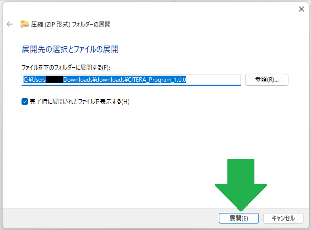
Windows エクスプローラーの標準機能を利用している場合は、展開ボタンを押してください。このとき、展開先のパスに2バイト文字（ひらがなや漢字などの日本語文字）が入っていないことを確認してください。（外部ツールの仕様により正常に動作しなくなります）

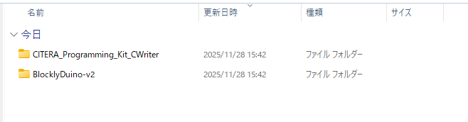
展開が完了すると次のような画面になります。

`CITERA_Programming_Kit_CWriter`にはマイコンに書き込むためのプログラムが入っています。 
`BlocklyDuino-v2`にはプログラミングツールが入っています。

次にドライバの書き換えに進んでください。

## ドライバの書き換え
**この作業は管理者権限が必要です** 
**Zadigは手順を間違えるとPCが不調になったりします。必ずこの手順通りに行ってください** 

プログラムをマイコンに書き込む時、ドライバを書き換える必要があります。

準備中...

## プログラミングツールの説明
プログラミングツールの起動の仕方

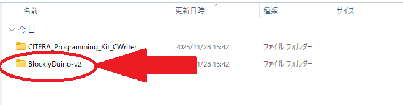

まず、BlocklyDuino-v2のフォルダをダブルクリックで開いてください。

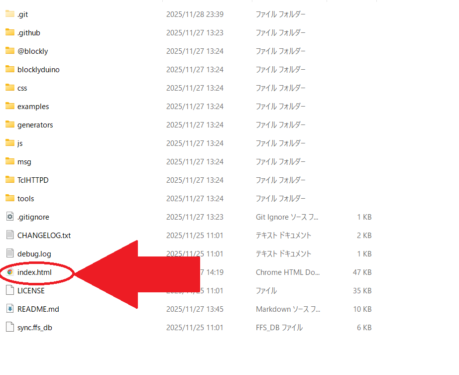

「index.html」もしくは「index」をダブルクリックで開いてください。
もし、使用するソフトウェアを聞かれた場合、「Microsoft Edge」もしくは「Google Chrome」を選択してください。
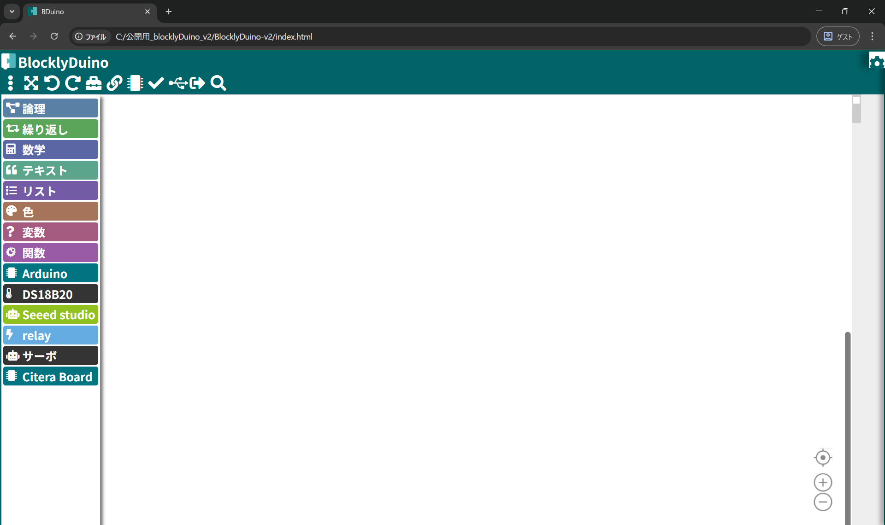
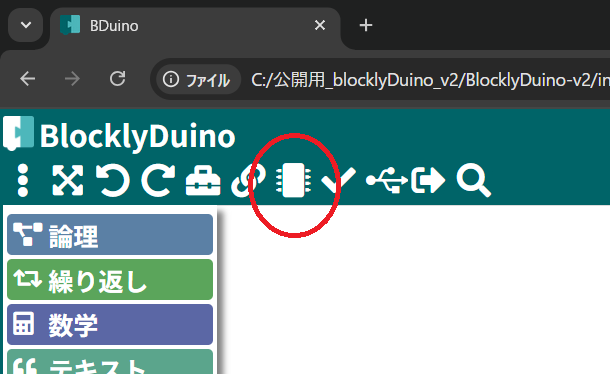

使用するボードの選択をするために、丸の箇所をクリックしてボードリストを開きます。

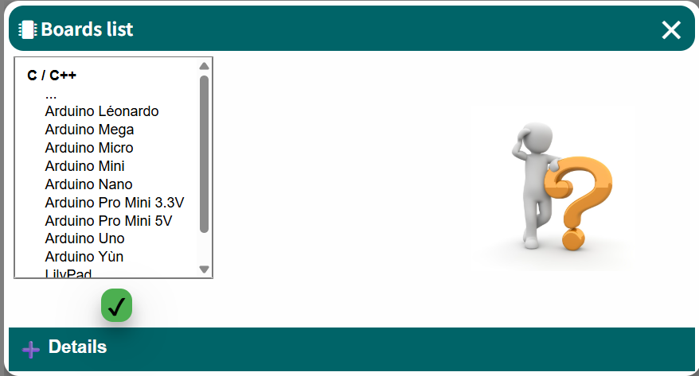

使用するボードはリストの下にあるので、下にスクロールします。

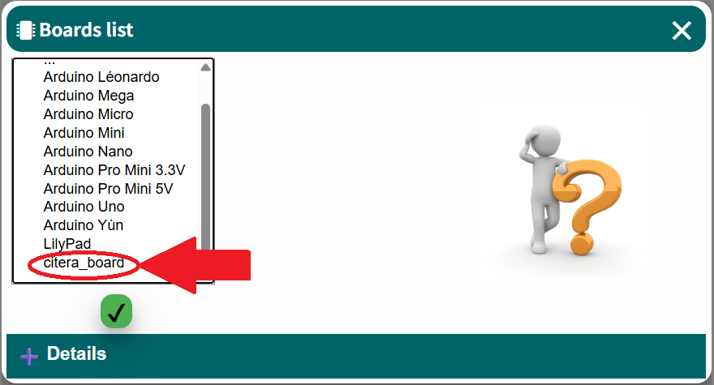

丸の箇所をクリックして「citera_board」を選択します。

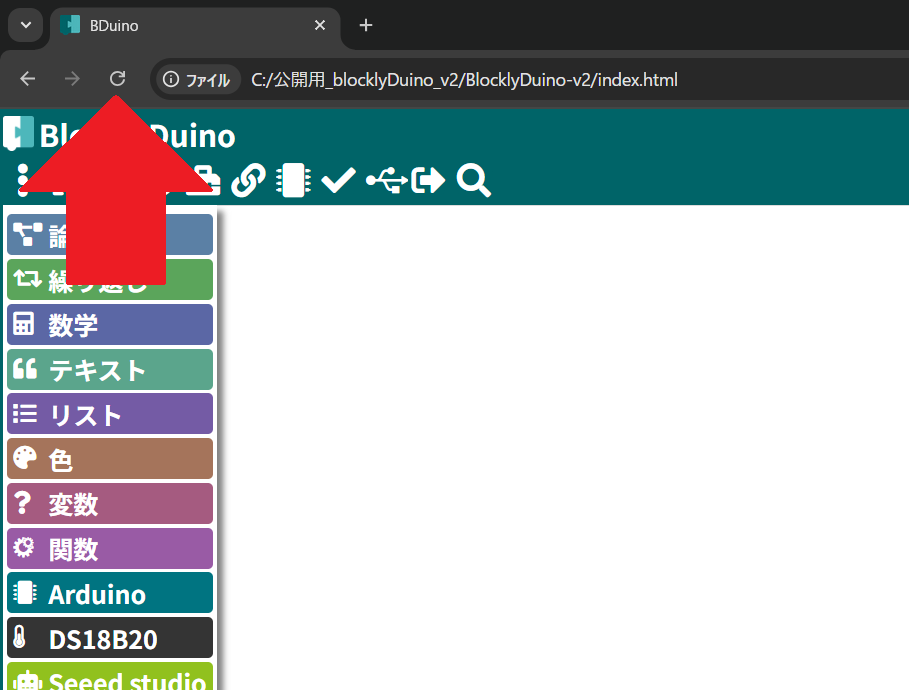

ボードの選択後、BlocklyDuino-v2の表示の更新をします。

正常にボードの選択が出来た場合。表示の更新後、左側のツールボックスはこのような表示になります。「Arduino」等のツールボックスが表示されている場合、ボードの選択が正常に出来ていません。再度、ボードの選択をしてください。選択が完了している場合、以下のように、「citera_board」が黄色にハイライトされます。

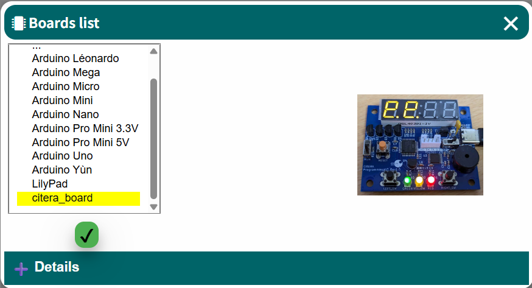

プログラミングの例：3分タイマー

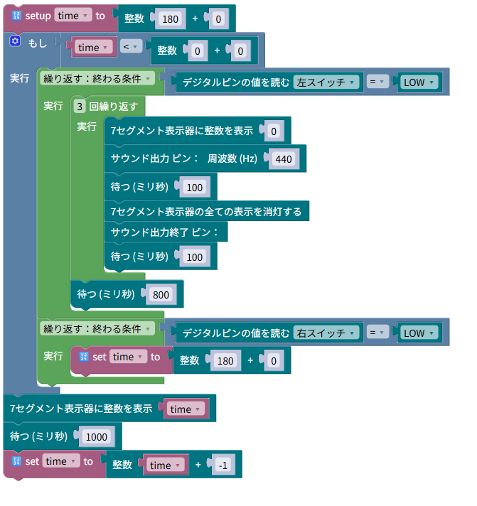

## 書き込みツールの説明
PCからマイコンボードにプログラムを書き込む方法について説明します。

1. マイコンボードとPCをUSBケーブルで接続します。
2. 電源をONにして、WRITEモードにスイッチをスライドさせます。
3. RESETボタンを押します。（画像では赤いボタンがリセットボタン）

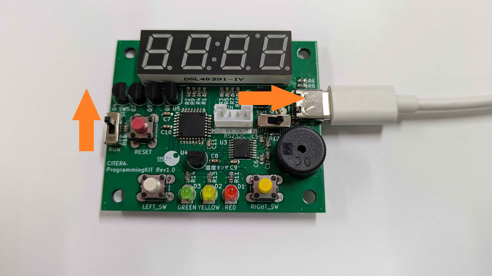

これでマイコンボードは書き込みモードになりました。

次に、プログラムを書き込みます。

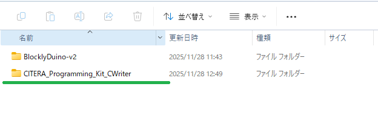
`CITERA_Programming_KIT_CWriter`フォルダを開きます

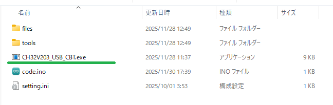
`CH32V203_USB_CBT.exe`(または`CH32V203_USB_CBT`)を実行してください。

## ライセンス
各ツール・設計図のライセンスについては、各フォルダに含まれている`README.md`をご参照ください。

`ProgrammingKit_回路図.pdf` 
`ProgrammingKit_DotMatrix_回路図.pdf` 
`ProgrammingKit_Car_回路図.pdf` 
の著作権は CITERA また 23C1130 が保持しています。また、この回路図データは Creative Commons Attribution 4.0 International (CC BY 4.0) ライセンスの下で提供されています。
https://creativecommons.org/licenses/by/4.0/

## 外部ツールについて
### Zadig
このプロジェクトにはUSBドライバインストールツール Zadigを使用しています。 
またReleaseにバイナリファイル（実行ファイル）が同梱されています。 
- ライセンス:GPLv3
- ソースコード:https://github.com/pbatard/libwdi
- 公式HP:https://zadig.akeo.ie/

ZadigはGPLv3ライセンスの条件に基づいて再配布されています。 
詳しくは`LICENSE/GPL-3.0.txt`をご参照ください。
### wchisp
このプロジェクトにはWCH ISP Tool wchispを使用しています。 
またReleaseにバイナリファイル（実行ファイル）が同梱されています。 
- ライセンス:GPLv2
- ソースコード:https://github.com/ch32-rs/wchisp
- バイナリコード配布先:https://github.com/ch32-rs/wchisp/releases/

wchispはGPLv2ライセンスの条件に基づいて再配布されています。 
詳しくは`LICENSE/GPL-2.0.txt`をご参照ください。

### xPack RISC-V Embedded GCC
このプロジェクトにはxPack GNU RISC-V Embedded GCCを使用しています。 
またReleaseにバイナリファイル（実行ファイル）が同梱されています。 
- ライセンス:GPLv3 with Runtime Exception + MITライセンス
- ソースコード:https://github.com/openwch/risc-none-embed-gcc
- バイナリコード配布先:https://github.com/openwch/risc-none-embed-gcc/releases

xPack GNU RISC-V Embedded GCCはMITライセンスの条件に基づいて再配布されています。 
詳しくは`LICENSE/MIT.txt`をご参照ください。
また、GPLv3 with Runtime Exceptionの条件に基づいて再配布されています。 
詳しくは`LICENSE/gcc-exception-3.1.txt`をご参照ください。

### BusyBox-w32
このプロジェクトにはBusyBox-w32を使用しています。 
またReleaseにバイナリファイル（実行ファイル）が同梱されています。 
- ライセンス:GPLv2
- ソースコード:https://github.com/rmyorston/busybox-w32
- 公式HP:https://frippery.org/busybox/

BusyBox-w32はGPLv2ライセンスの条件に基づいて再配布されています。 
詳しくは`LICENSE/GPL-2.0.txt`をご参照ください。

### GNU Make
このプロジェクトにはGNU makeを使用しています。 
またReleaseにバイナリファイル（実行ファイル）が同梱されています。 
- ライセンス:GPLv3
- ソースコード入手先/公式HP:https://www.gnu.org/software/make/

GNU MakeはGPLv2ライセンスの条件に基づいて再配布されています。 
詳しくは`LICENSE/GPL-3.0.txt`をご参照ください。

これらのソフトウェアの開発者に感謝いたします。